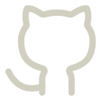
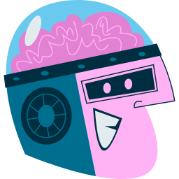
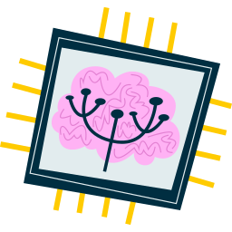

<!-- ===================== HEADER / HERO ===================== -->

  <!-- Saudação -->
  

    <samp>Hello! Welcome to my GitHub 👋</samp>
      
    
      Olá, sou o Eduardo, desenvolvedor Web/Mobile 
      Apaixonado pela tecnologia e inovações.
    
  

  <!-- Imagem principal -->
  

  <!-- Botões sociais  -->
  

    
    
    
    
  

<!-- Contador de visitas -->

  

<!-- ===================== SOBRE MIM ===================== -->

  
## 🧑‍💻 Sobre mim 

<!-- Imagem lateral + texto -->

  

  <!-- Texto principal menor -->
  
 
    Sou desenvolvedor com experiência prática em desenvolvimento <b>Web</b>, <b>Mobile</b> e <b>Back-end</b>, 
    atuando com React, Next.js, React Native, Angular, Java, TypeScript e Python. 
    Tenho vivência em ambientes corporativos com infraestrutura, integração de sistemas, 
    análise de dados e bancos de dados. Busco oportunidades para criar soluções eficientes e escaláveis.
  

<!-- Filosofia pessoal -->

<b>Como gosto de trabalhar:</b> valorizo ambientes colaborativos e acredito que as melhores soluções surgem da troca de ideias. Gosto de usar a criatividade para transformar desafios em soluções simples e úteis.

 

<!-- ===================== PROJETOS EM DESTAQUE ===================== -->
## ⭐ Projetos em destaque

<!-- ---------- SINALIZA ---------- -->

  

Sistema desenvolvido como Trabalho de Conclusão de Curso (TCC), focado em criar uma solução tecnológica com propósito social e aplicação prática.

 

<!-- ---------- GREENHOUSE ---------- -->

  
  
  

    
  

  
  Back-end de um e-commerce de plantas 🌱 com foco em arquitetura escalável, APIs REST e estrutura preparada para evolução do projeto.
 

 

<!-- ---------- EVOLVA MOBILE ---------- -->
  

    
  

Aplicativo mobile desenvolvido para ser uma gamificação de atividades diárias. Desenvolvido em React-Native como trabalho acadêmico

<!-- ===================== STACK ===================== -->

  
## 🚀 Tecnologias & Ferramentas

<!-- Imagem da stack centralizada acima do texto -->

  

 

<!-- Texto resumo da stack -->

Minha stack é focada em produtividade e consistência. Trabalho principalmente com TypeScript no ecossistema Web,
além de Python e Java para automação e robustez. Uso MySQL, PostgreSQL e MongoDB para dados.
Git + Conventional Commits, Docker, Figma e Postman fazem parte do fluxo diário.

<!-- ===================== BADGES DE TECNOLOGIAS ===================== -->
#### Desenvolvimento

<!-- ===================== FERRAMENTAS ===================== -->
#### Ferramentas

---

<!-- ===================== STATS GITHUB ===================== -->

